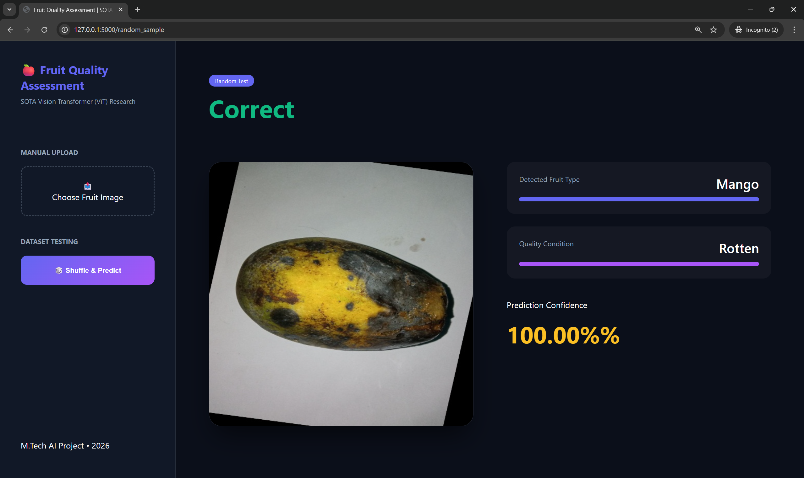

Fruit Quality Assessment: SOTA Dual-Head Vision Transformer

An end-to-end deep learning system designed for the automated classification and quality assessment of fruits. This project utilizes a custom Multi-Head Vision Transformer (ViT-B/16) architecture to simultaneously predict fruit type and quality condition (Fresh, Rotten, or Formalin-mixed).

🖥️ Frontend Interface
Above: The full-page dashboard featuring a persistent sidebar for dataset shuffling and a main results stage with dual confidence progress bars.

🚀 Key Features
SOTA Architecture: Implements a custom ViTTwoHead class built on top of vit_b_16, branching into two independent classification heads.

Dual-Head Inference: Simultaneously predicts Fruit Category (5 classes) and Quality Status (3 classes) in a single forward pass.

Full-Page Dashboard: A professional local web interface built with Flask, featuring a "Random Shuffle" dataset tester and a manual upload portal.

Research Integrity: Designed to demonstrate deployment capabilities while protecting unpublished research methodology and model weights.

🛠️ Tech Stack
Deep Learning: PyTorch, Torchvision (Vision Transformer)

Backend: Python, Flask

Frontend: HTML5, CSS3 (Modern Flexbox Layout)

Development: VS Code, Virtual Environments (venv)

📂 Project Structure
Plaintext

FruitQualityApp/
├── app.py                 # Flask server & Routing logic
├── model_helper.py        # Custom ViT architecture & Inference pipeline
├── requirements.txt       # Project dependencies
├── static/                # CSS & Display images
│   └── style.css          # Full-page dashboard styling
├── templates/             # HTML Templates
│   └── index.html         # Main dashboard interface
└── .gitignore             # Critical: Excludes .pth weights & local datasets
🏗️ Setup & Installation
Clone the repository:

Bash

git clone https://github.com/YourUsername/Fruit-Quality-Assessment.git
cd Fruit-Quality-Assessment
Create a Virtual Environment:

Bash

python -m venv fruit_env
source fruit_env/bin/activate  # On Windows use: fruit_env\Scripts\activate
Install Dependencies:

Bash

pip install -r requirements.txt
Running the App:

Bash

python app.py
Navigate to http://127.0.0.1:5000 in your browser.

